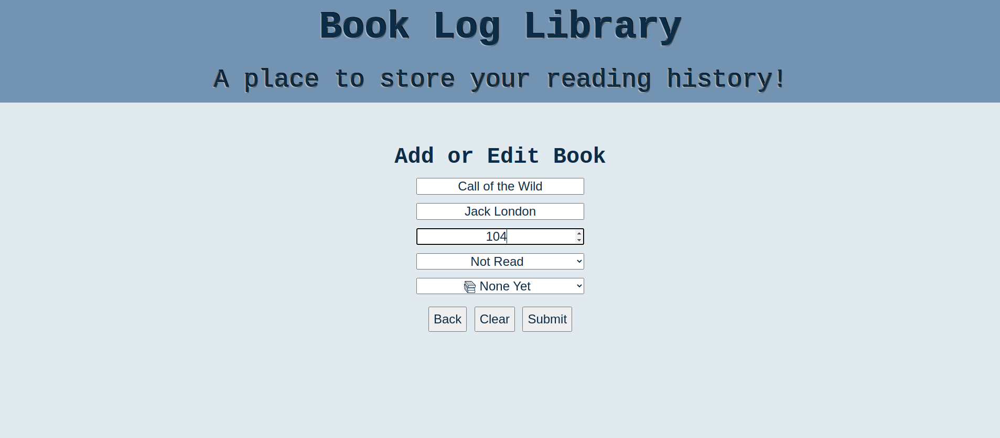
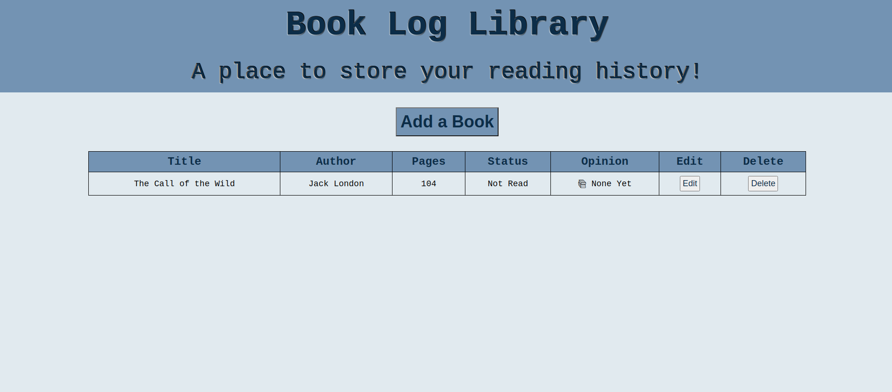

# Reading Log Library

**Objective:**

To create a reading log library that will store books the user has read for future reference. I used HTML, CSS, and JavaScript for this project.

***Completed Images***

Table Page (No Entries): This is the page the user will see when first joining the site.

Form Page (No Entries): This is the page the user will see when they click the "Add a Book" button.

Form Page (With Entry): 

Table Page (With Entry):

***Features****

1. The first page users will see has a table that books can be added to using the "Add a Book" button. The first line of text in the table will be replaced with the users first book entry.

2. Once the "Add a Book" button has been clicked users will be shown a form to complete. The table will be hidden and the hidden form will present on the page in its place.

3. The form features three text boxes for entering the title, author, and pages in the book. It also has two selection menus, one to choose if the book has been read or not and one to show the user's opinion of the book. The tite, author, and read status are required with pages and opinion being optional fields.

4. The opinion selection features five choices: ❤️ Loved It, 😃 Liked It, 😐 Just Ok, ☹️ Terrible, 📚 None Yet.

5. The form page also has 3 buttons:

   a. The "Back" button will return you to the table view of the page and clear any information that was in the form. 
  
   b. The "Clear" button will leave the user on the form but clear all information that has been entered.
  
   c. The "Submit" button will submit the information, place it on the table, clear the form, and take the user back to the table view of the page.

6. Once the form data has populated the table the user has access to two more buttons, edit and delete:

    a. The "Edit" button will take the user back to the form view of the book selected for edits. The information from the table will be populated in the form so the user can update the information then resubmit it using the submit button. The submit button will clear the initial row entry and replace it with the new updated information from the user's edits.
    
    b. The "Delete" button will delete the row entirely on click.
